# Gallery: five ways to make the molecule matter

This is not a style catalogue. It is a set of visual answers to the first
question behind a figure: *what should the reader understand at a glance?*

<p align="center">
  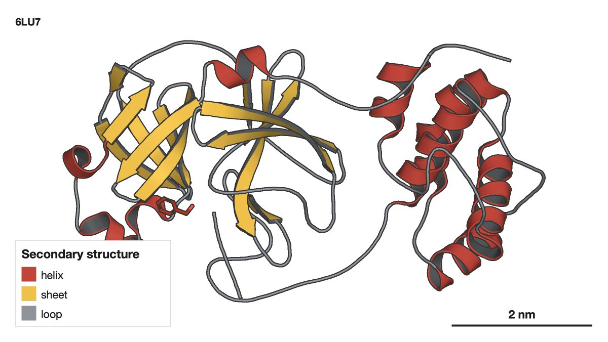
  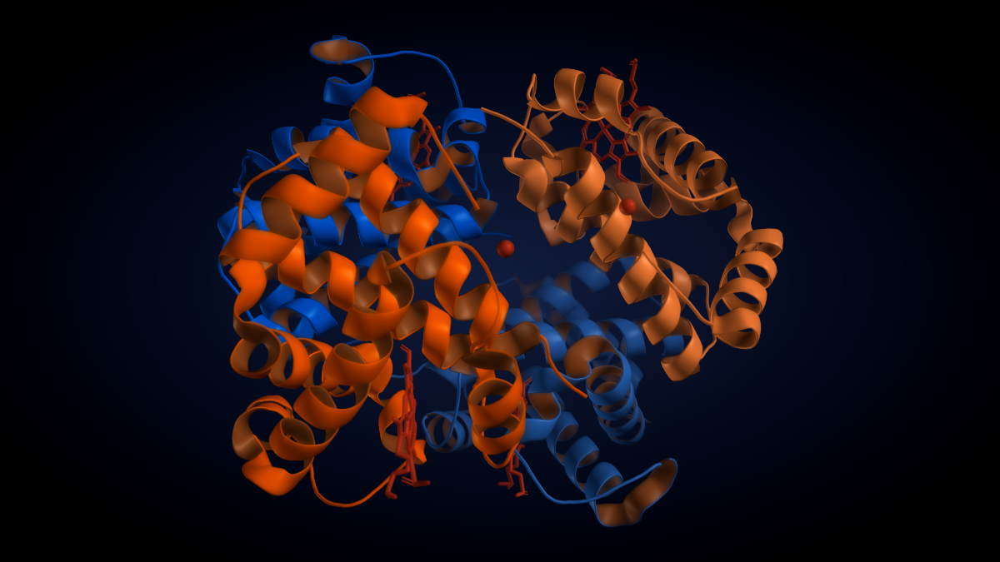
  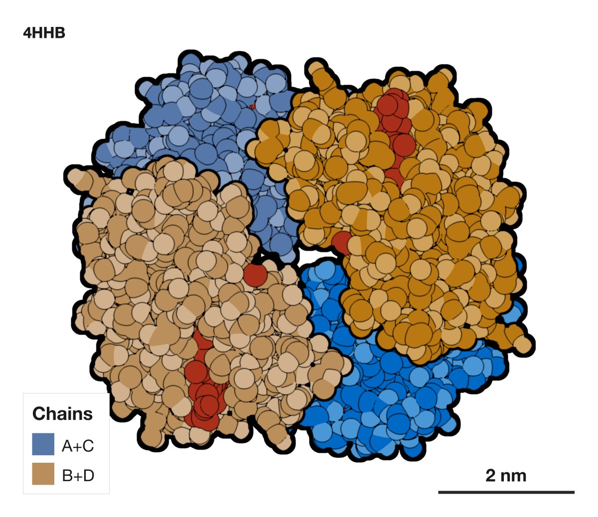
</p>

| When the figure needs to… | Start with | See it here |
|---|---|---|
| explain a result without visual noise | `viz paper` | [fold and topology](#the-fold-itself) |
| command a room or open a talk | `viz story` | [dark-stage assembly](#the-same-complex-as-a-photograph) |
| make molecular architecture tangible | `viz illustration` | [haemoglobin in ink](#every-atom-outlined) |
| show why a ligand binds | `viz site` | [binding site](#binding-site) |
| show model confidence honestly | `viz confidence` | [AlphaFold confidence](#alphafold-confidence) |

Every image below is the direct output of the one or two commands printed under
it. No retouching, no hand-picked viewpoint, no cleanup afterwards. Orientation,
canvas shape, framing, colour grouping, ink weight, scale bars and colour keys
are decided by the plugin.

Images here are downsized to 1200 px for the repository; they render at
1800–2600 px. The [README](../README.md) is the shortest route to your first
image; this page is where to choose a visual language deliberately.

---

## From a binding site to an assembly

One structure at four magnifications, then the complex it sits in. Every plate
carries a scale bar, so the ladder is readable as a ladder.

### Binding site

The camera looks *into* the pocket: the view direction is taken from the
protein's centre out through the ligand, so the ligand is the nearest thing to
the reader rather than something behind the fold. Contact residues are drawn
as whole residues, polar contacts dashed, and a residue whose name would land
on one already placed is left unlabelled.

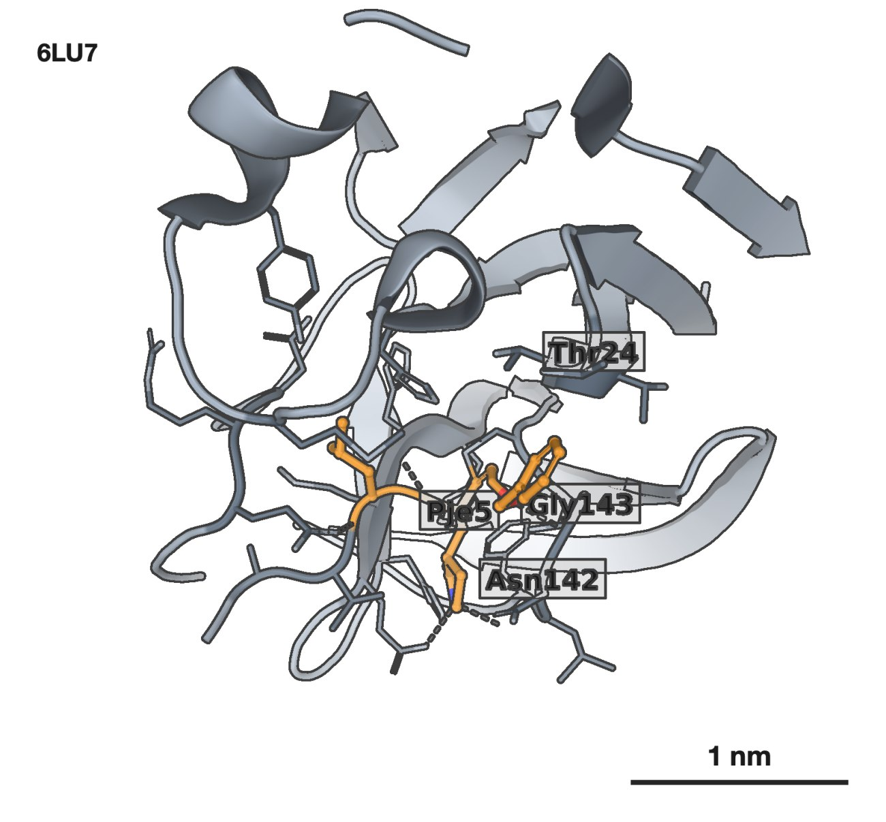

```
viz site
viz_label residues, byres (polymer within 4.2 of organic)
```

### One loop, made the subject

The catalytic loop keeps full colour; the rest of the fold is desaturated so
the eye has somewhere to land. The key re-reads its swatches off the faded
scene rather than the colours as assigned.

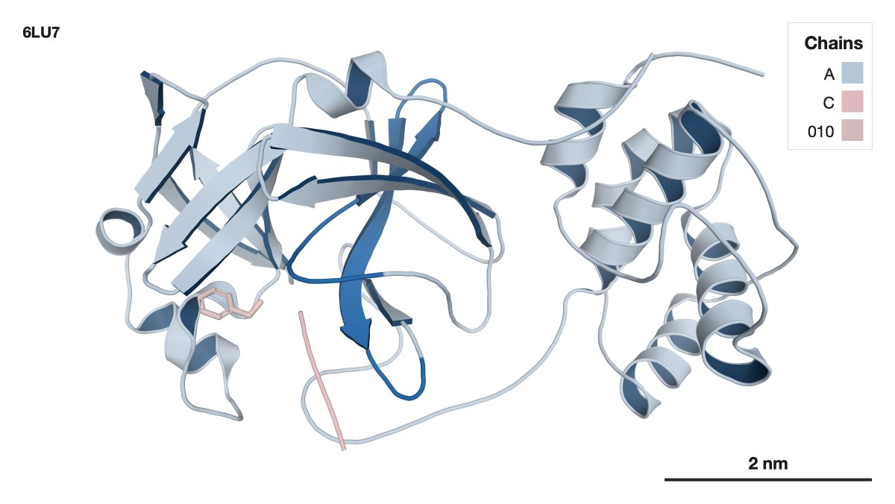

```
viz publication
viz_focus resi 140-170, 0.8
```

### The fold itself

Helix, sheet and loop with a key. Elements too short to be real are demoted to
loop, so no two-residue helix renders as a barrel. Of everything here this is
the plate that survives greyscale best.


```
viz topology
```

### Every atom, outlined

Three tiers of ink — heavy silhouette, medium chain boundary, light per-residue
contour. The four subunits alternate in chroma within their two chain colours,
so they can be counted. The haems take the one reserved accent.


```
viz illustration
```

### A 21-chain assembly

Stood on its sevenfold axis, so the two rings stack and the cap caps. A black
line between every subunit, and copies alternating in chroma at constant hue,
the way Goodsell's two greens do.

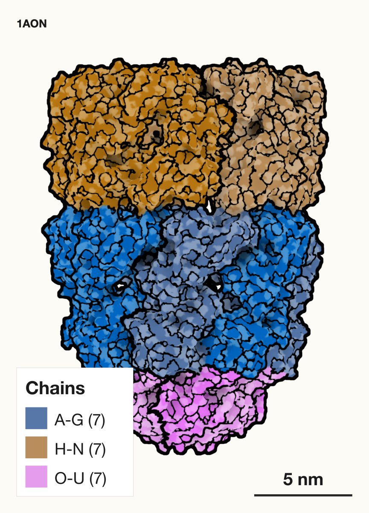

```
viz goodsell
```

### The same complex, as a photograph

Dark stage, rim light, bloom and a shallow focal plane.

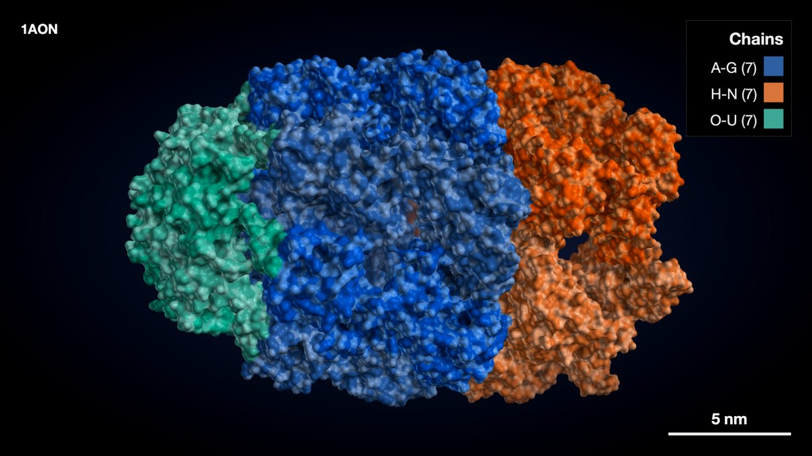

```
viz story, view=hero
```

### A clean hero, ready for a room

For a customer pitch, cover, or opening slide, the molecule should not compete
with a key, scale bar, or PDB identifier. `story` deliberately removes those
publication annotations while retaining the same cinematic lighting pipeline.


```
viz story, frame=slide, view=hero
viz_render haemoglobin-hero.png, slide
```

Add `legend=1`, `scalebar=20`, or `name=Haemoglobin` to `viz_render` only when
the image needs to carry scientific annotation as well as atmosphere.

---

## Illustration idioms

Four ways of drawing the same protein, each borrowed from a published figure
rather than invented.

### Architect

Helices as cylinders inside an inked contour, with a soft grey envelope behind
that states the fold's shape before any detail.

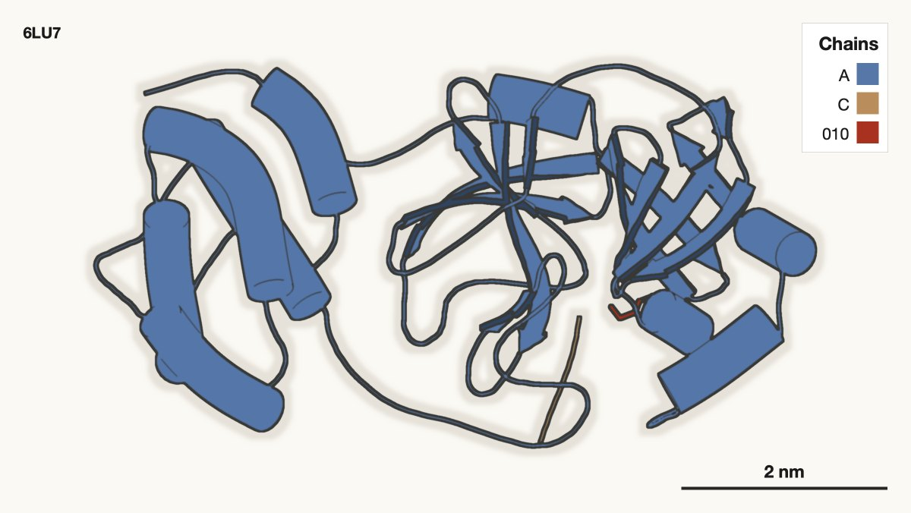

```
viz architect
```

### Contour context

The same machinery with the context pushed back: line art, with solid colour
reserved for the residues lining the site.

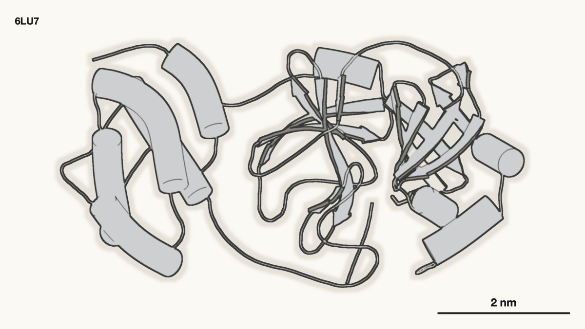

```
viz architect, coloring=mono, palette=#E8E4DC
viz_focus byres (polymer within 5 of organic), 0.85
```

### Cel-shaded

Banded colour and a heavy ink line. Flat shading is why this one keeps its
chain separation when printed in black and white.

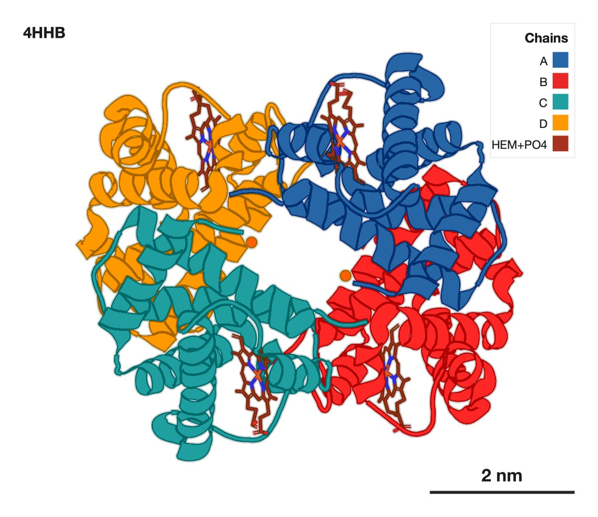

```
viz comic
```

### Clay

One material, soft shadowless light, occlusion doing all the work. Shape
without colour — and without chain information, deliberately.

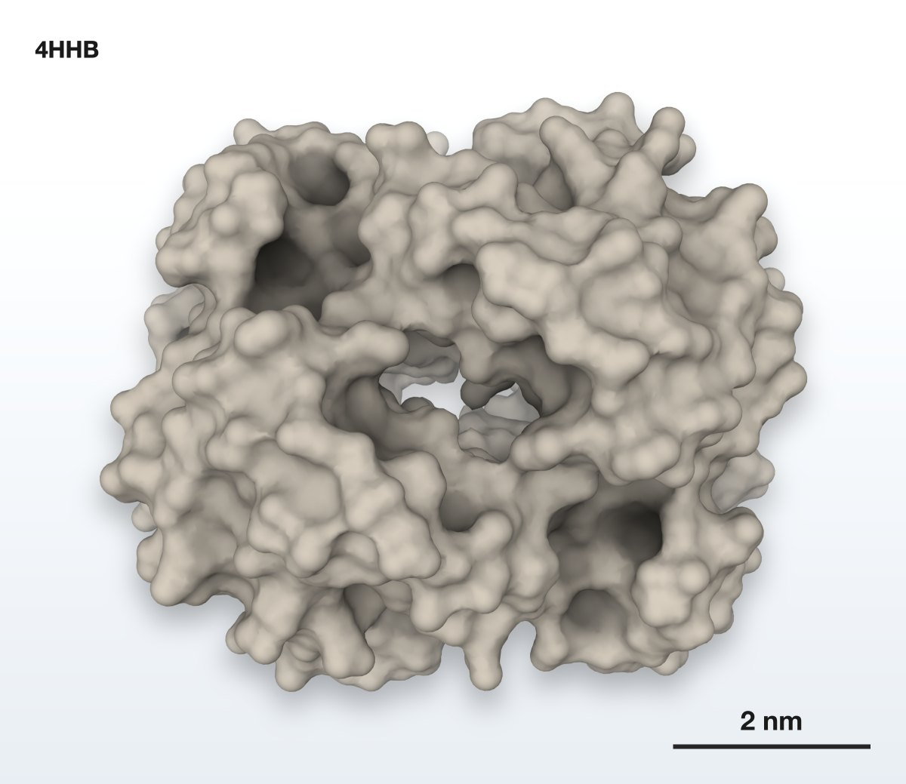

```
viz clay
```

---

## Nucleic acid and measured quantities

Where the colour means a number, the key is not optional.

### A duplex whose base pairs meet

PyMOL's default nucleic mode leaves the base stubs hanging in mid-air; the
ladder rungs here join the two strands.

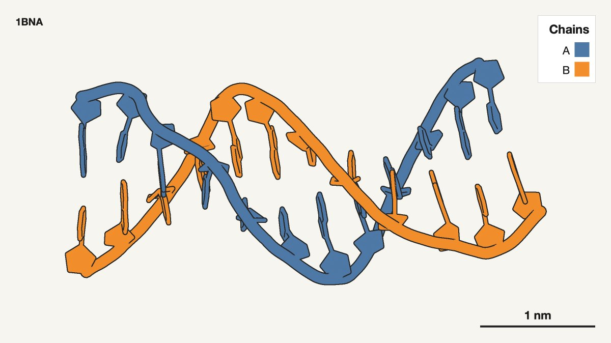

```
viz flatcartoon
```

### AlphaFold confidence

The official four bands with their key. The disordered tail is drawn, not
cropped, so the reader can see how much of the model is guesswork.

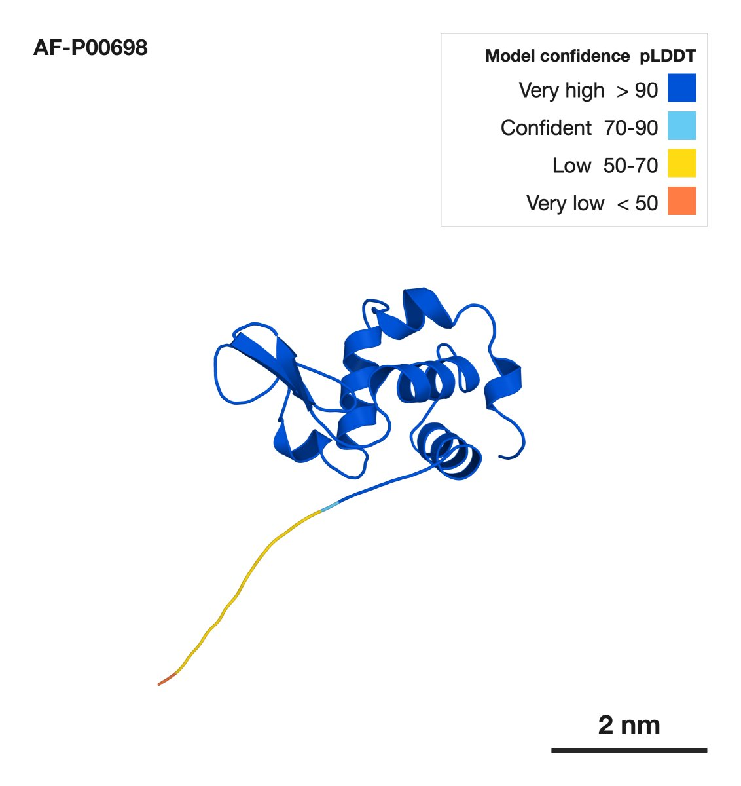

```
viz confidence
```

### Kyte–Doolittle surface

A five-step ramp with both ends labelled in words. The colour is the
measurement, so depth fade is switched off to keep the ramp true.

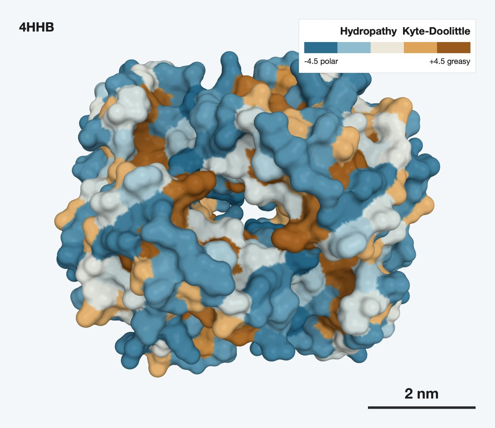

```
viz hydrophobic
```

### Surface over fold

A translucent envelope with the cartoon inside — shape and secondary structure
in one plate.

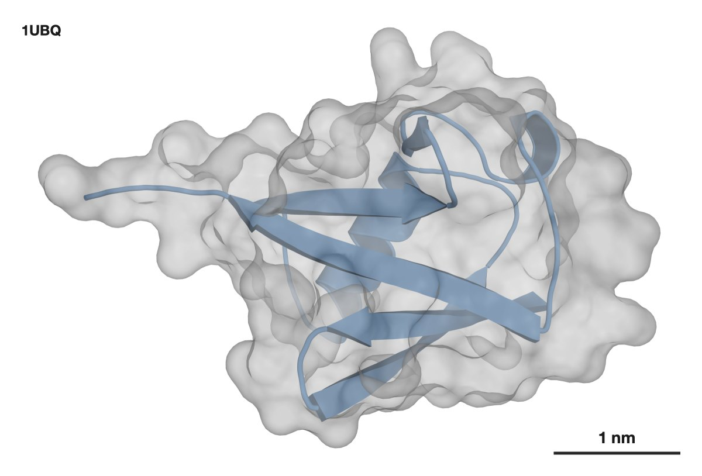

```
viz ghost
```

---

## Mixing

`rep` and `viz_mix` take `selection=representation` rules separated by `/`.
Rules apply in order and each claims only what no earlier rule took, so
overlapping selections do not double-draw and `rest` means what is left.
Selections are ordinary PyMOL selections plus the words `protein`, `nucleic`,
`dna`, `rna`, `ligand`, `ions`, `solvent`, `polymer`, `het` and `rest`.
`viz_paint` uses the same grammar for colour, and the rules become the key.

A protein–nucleic complex is the clearest case for it: the bases are chemistry
and want their rings drawn, the protein is a body and wants a surface you can
see through.

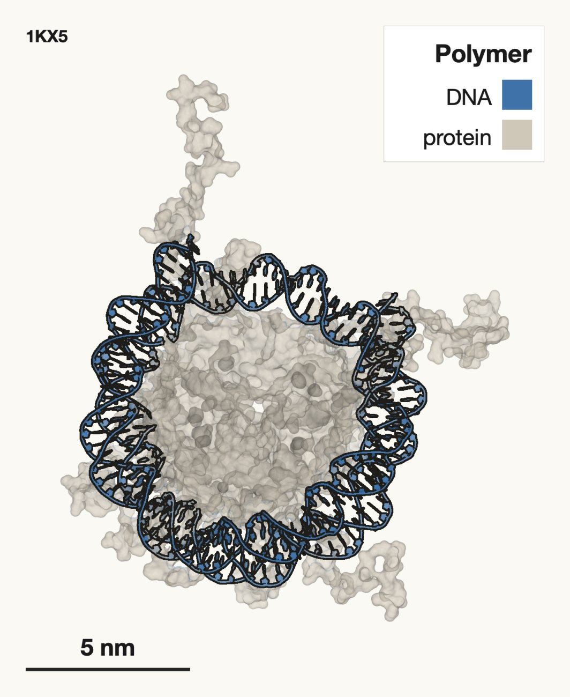

```
viz nucleoprotein, rep=nucleic+ghost
```

The protein half is a free choice — `nucleic+cartoon`, `nucleic+spheres`,
`nucleic+tube` — and the spec form generalises it to any selection:

```
viz_mix chain A=surface / chain B=cartoon / ligand=ballstick / rest=lines
```

## Schematic drawing

Helices as cylinders, thin loops, a translucent envelope behind, chains
painted by rule and everything unclaimed left near-white. This is one command
and one paint spec.

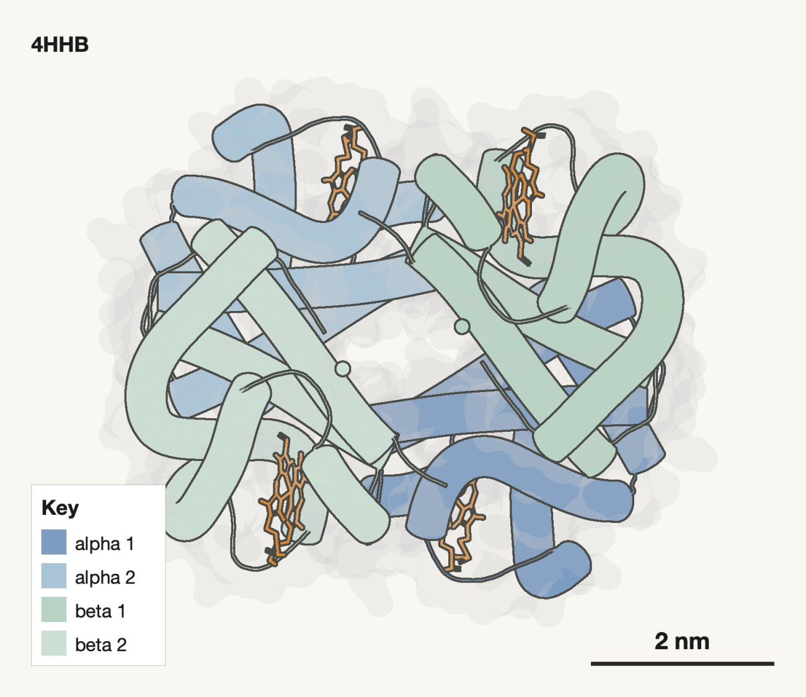

```
viz diagram
viz_paint ligand=#D98A3D=haem / chain A=#7E9CC2=alpha 1 / chain C=#A9C4D6=alpha 2 /
          chain B=#B7D3C3=beta 1 / chain D=#CBDFD2=beta 2 / rest=#EDEAE4
```

`diagram` also marks every chain break with a **dotted arc** that bulges clear
of the fold. A straight dashed chord between the two ordered ends passes
through the middle of the protein and is hidden by it, which is exactly where
a missing loop is not. Breaks need both a residue-number jump and a Ca-Ca step
over 4.6 A, so a renumbering with no real gap is not marked. `viz_gaps` runs
it on demand.

## Two idioms and a highlight

The histone core as cylinders, the DNA with its bases as filled rings, and the
DNA-contacting residues banded in one loud colour on an otherwise quiet fold.
Three commands.

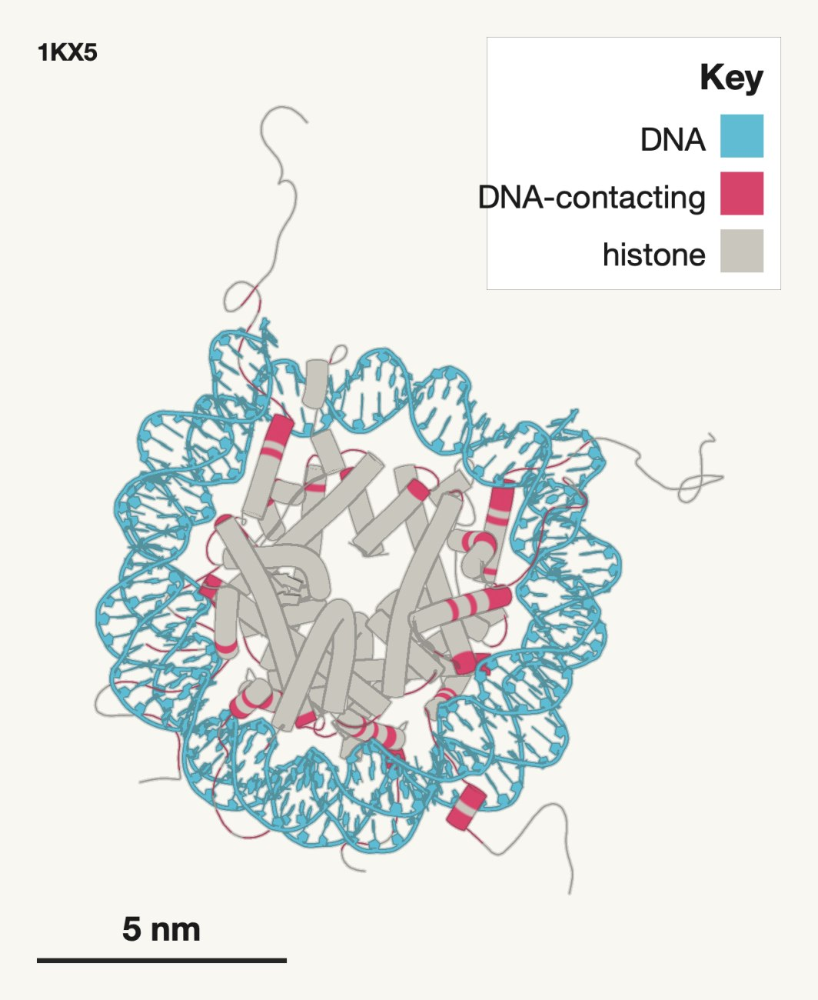

```
viz diagram
viz_mix protein=cartoon / nucleic=nucleic
viz_paint nucleic=#5FBCD3=DNA /
          byres (polymer.protein within 4.5 of polymer.nucleic)=#D6446B=DNA-contacting /
          rest=#C9C6BE=histone
```

## Superposition

The reference keeps a quiet neutral; the mobile structure takes a spectrum
along its sequence, so you can see which end went where. `cmd.super` aligns on
structure, so it holds up on remote homologs — here myoglobin on a haemoglobin
alpha chain, 2.55 A over 711 atoms.

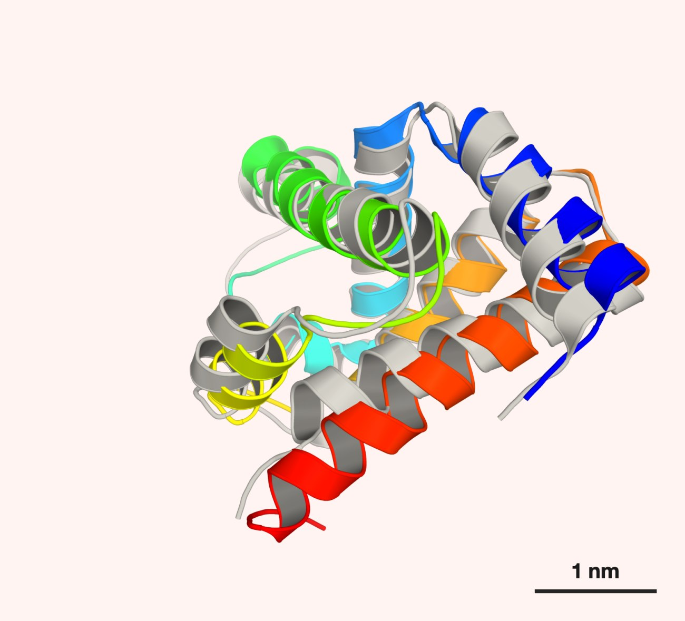

```
viz publication, coloring=keep
viz_super myoglobin, haemoglobin
viz_bg blush
```

## Magnified callout

Boxed on the overview, joined to its panel by dashed leaders, with the
overview backed off so the panel has somewhere to sit.

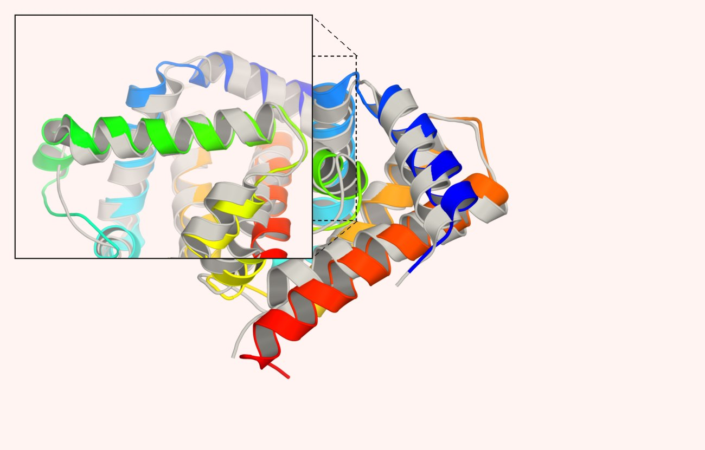

```
viz_inset resi 60-75 and myoglobin, out.png, size=1800x1150, zoom=4.5
```

---

## An interaction, at three scales

Three styles answering three questions about the same kind of event. Each
finds the two partners itself and works out which residues actually touch. For
a biologically named host/binder pair, set the roles once with `viz_partners`.

### Which surfaces meet — `interface`

One partner is a body, the other a ribbon lying across it, each with its own
contact residues brought forward. Two translucent surfaces over two cartoons
is four things in the same place, so the two sides get different treatments.

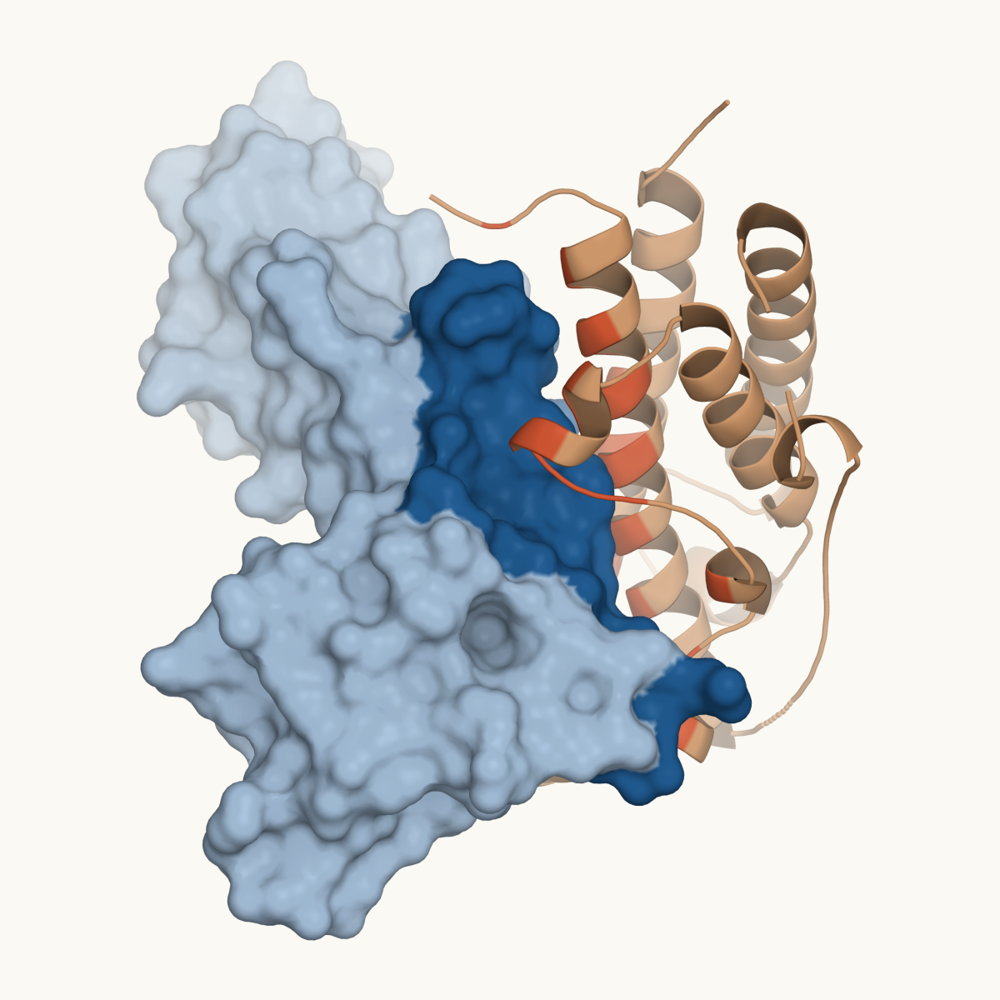

```
viz interface
```

### What does it actually touch — `epitope`

The **host surface** painted with the footprint of its binder. The first
selection passed to `viz_partners` is the host; this makes antibody–antigen
figures controllable instead of guessing biological roles from size. Only the
measured footprint is shown, so no partner geometry hides the evidence.

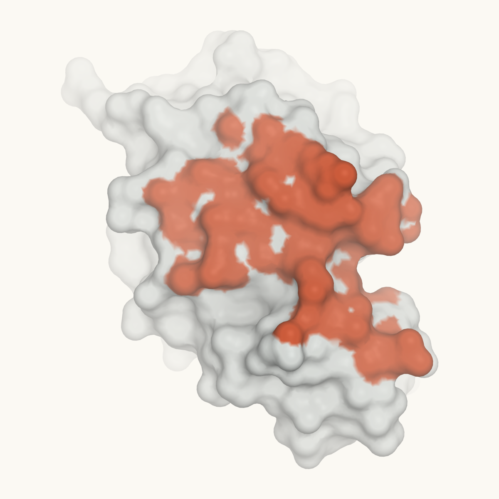

```
viz_partners chain Y, chain H+L
viz epitope
```

### The binding event itself — `peptide`

The receptor as a quiet surface, the peptide thick in its groove with the side
chains that do the work, the groove marked and polar contacts dashed.

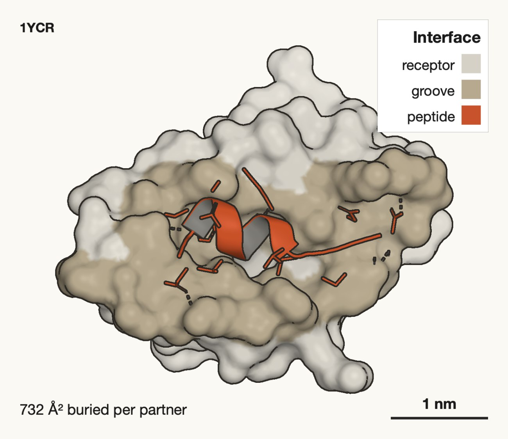

```
viz peptide
```

### The residues themselves — `contacts`

The close-up a referee asks for: contacting side chains of both partners as
sticks, with polar contacts dashed. At most four spatially separated residues
are labelled; the full contact inventory belongs in `viz_contact_table`, not
on top of the molecular evidence.

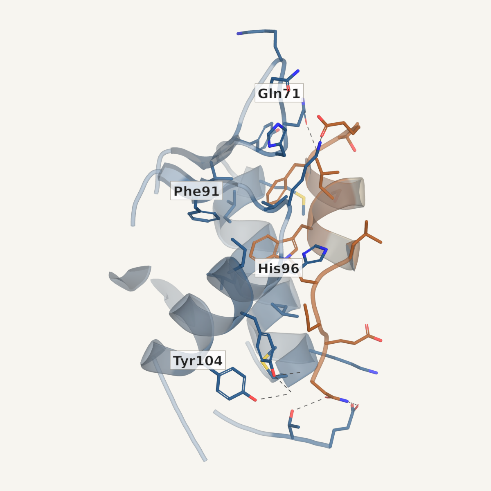

```
viz contacts
```

### Both faces at once — `viz_openbook`

An interface figure has a geometric problem: whichever partner faces the
reader stands in front of the mark it made on the other. Opening the complex
turns both contact faces toward the camera — a quarter turn each in opposite
directions, not a single half turn of one, which would leave both faces
pointing sideways.

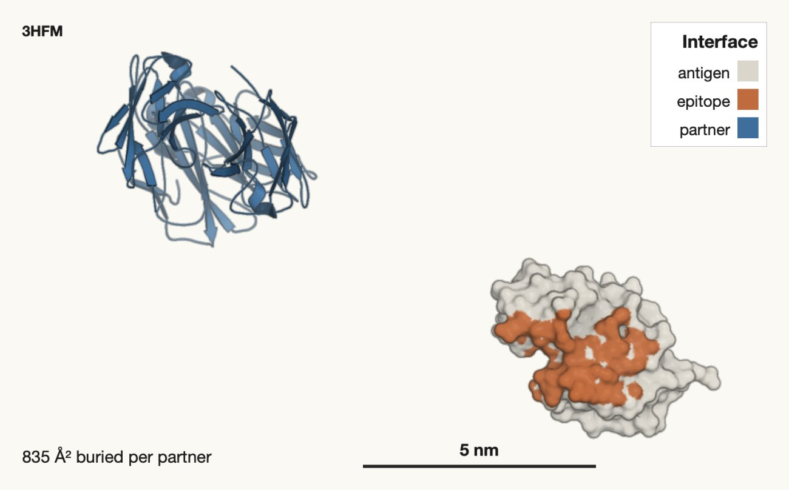

```
viz_partners chain Y, chain H+L
viz epitope
viz_openbook
```

It moves coordinates; reload to undo.

`viz_interface` does the analysis on its own and prints the numbers:

```
viz_interface                     # splits into its two largest parts
viz_interface chain A, chain B    # or name them
```

With more than two chain groups present, "the two partners" is a guess and the
tool says so. `viz_partners a, b` settles it, and the styles use it instead of
guessing. Buried area is measured, not described — 1YCR comes out at 732 Ų
against 732 Ų from an independent Shrake–Rupley calculation — and is printed
on the plate.

`epitope` marks the atoms that actually lose solvent-accessible area on
binding, not whole residues within a cutoff — measured on MDM2 that is 62
atoms rather than 96, because a whole-residue footprint paints the far side of
every contact residue too.

`viz_contact_table` writes the residue pairs and their distances — 49 pairs
for 3HFM, closest first — as a tab-separated file for a supplement.

---

## Structures used

`4hhb` haemoglobin · `6lu7` SARS-CoV-2 main protease with the N3 inhibitor ·
`1aon` GroEL/GroES chaperonin · `1bna` Dickerson–Drew DNA dodecamer ·
`1ubq` and `1ubi` ubiquitin · `1kx5` nucleosome · `1mbn` myoglobin · `1a22` growth hormone-receptor · `3hfm` antibody-lysozyme · `1ycr` MDM2-p53 peptide · AlphaFold model of hen lysozyme
(`AF-P00698`).

To reproduce any plate, fetch the code and run the command under it.
